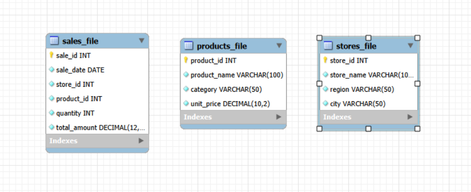
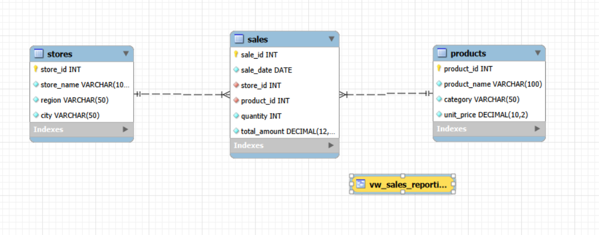

# Handling Difficulty in Data Access (Retail Store Context)

This repository demonstrates the core database limitation known as **Difficulty in Accessing Data**, which typically occurs in traditional isolated file systems or siloed structures, and shows how it can be seamlessly resolved through structured **Relational Database Design (RDBMS)** and **Views**.

---

## The Problem (Siloed File-Based System)
In `bad_retaildb`, sales data, physical store locations, and product catalogs are managed independently as isolated flat files (`sales_file`, `stores_file`, `products_file`). 

When a manager asks an ad-hoc business question like: **"Show me the total sales performance for the last 6 months broken down by geographical region,"** the answer is impossible to get directly from the transaction file because the `region` attribute is hidden inside a different file. Users have to write repetitive, manual extraction programs or custom scripts every single time.

---

## The Solution (Relational Model & Abstraction Views)
In `good_retaildb`, the entities are organized using relational mapping. Relational constraints (`FOREIGN KEY`) are enforced to link transactions to master entity definitions. 

Furthermore, a reporting database abstraction layer (**Database View**) named `vw_sales_reporting` is created. This compiles all data dimensions into a unified analytical layer, enabling non-technical users or BI tools to answer critical operational questions instantly with simple query expressions.

---

## How to Run the Demonstration

1. **Step 1: Deploy Isolated Structures** Execute `01_bad_retail_setup.sql` to build the isolated tables and load 6 months of retail transactional records.
   
2. **Step 2: Observe Access Limitations** Run `02_bad_retail_workflow_test.sql` to see how hard it is to manually search and correlate facts across flat tables without relationship bindings.

3. **Step 3: Establish Relational Integrity** Execute `03_good_retail_setup.sql` to construct the professional database architecture with enforced schema keys.

4. **Step 4: Execute Analytical Reports** Run `04_good_retail_analytics_test.sql` to see how the integrated layout easily generates deep analytical breakdowns (Regional trends, product matrices, and time-series reports) effortlessly.

---

## Tech Stack & Concepts Covered
* **Database Engine:** MySQL / MariaDB
* **Relational Design:** Primary Key & Foreign Key Relationships
* **Data Aggegation:** Advanced Grouping (`GROUP BY`), Time Formatting (`DATE_FORMAT`), and Summation
* **Database Abstractions:** Complex Reporting Views (`CREATE VIEW`)
